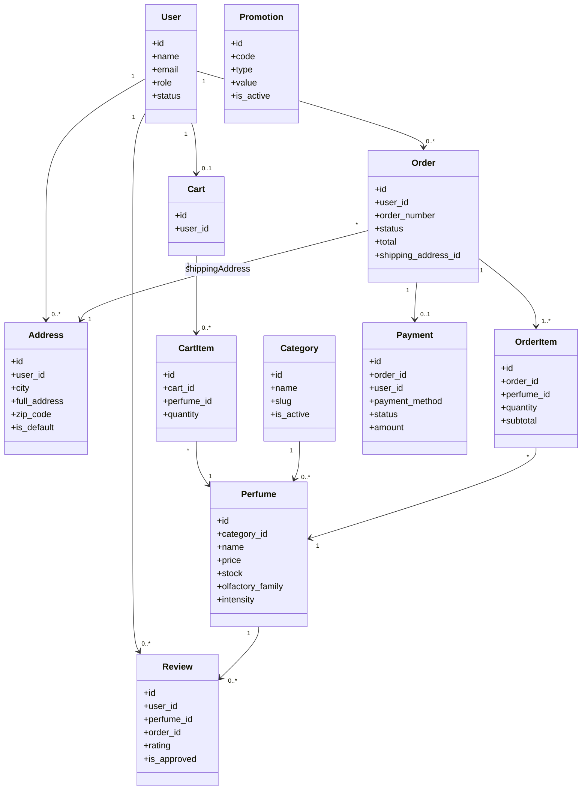
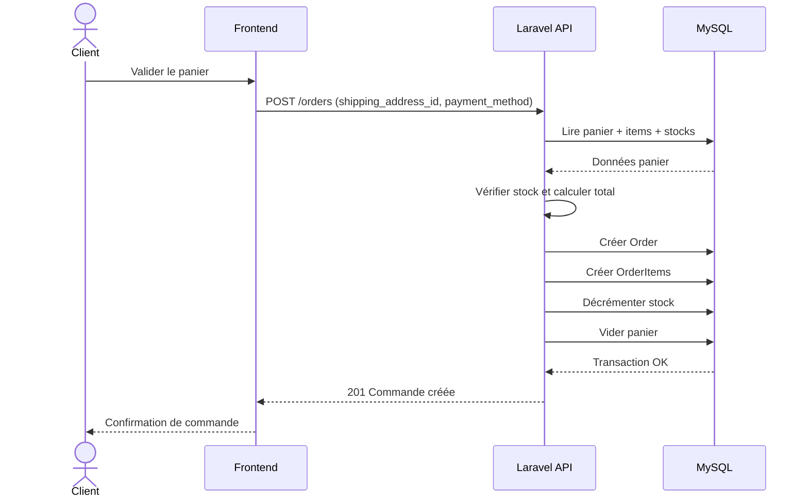
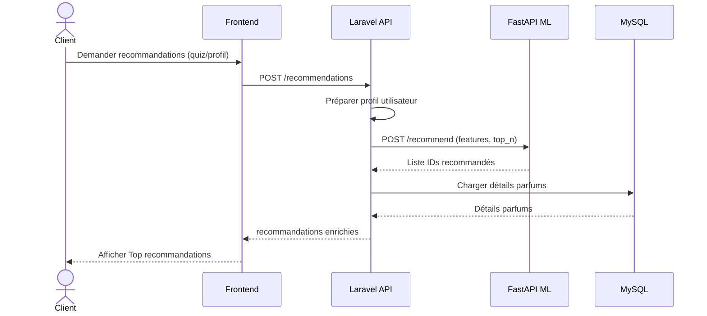
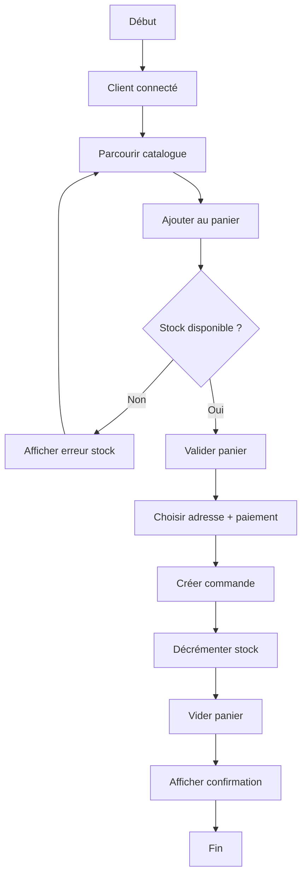
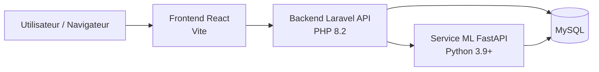

# 📘 Documentation Technique Détaillée - Site Parfum

Ce document décrit l'architecture technique, les services implémentés et la logique du projet.

---

## 1. Architecture Globale

Le projet repose sur une architecture **Headless** (Découplée) :
*   **Backend (API)** : Laravel 10 sert uniquement des données via une API REST JSON. Il ne gère pas l'affichage HTML.
*   **Frontend (Client)** : React (Vite) consomme cette API pour afficher l'interface utilisateur.

---

## 2. Services Backend (Laravel)

### 🔐 Service d'Authentification (`AuthController`)
Gère la sécurité et les sessions utilisateurs.
*   **Technologie** : Laravel Sanctum.
*   **Fonctionnement** :
    *   Lors de la connexion (`/login`), un token API chiffré est généré et renvoyé au client.
    *   Ce token doit être envoyé dans le header `Authorization: Bearer <token>` pour chaque requête sécurisée.
    *   Gestion des rôles (Admin, Modérateur, Client) via un champ `role` dans la base de données.

### 🌸 Service Catalogue (`PerfumeController`)
Gère l'inventaire des produits.
*   **Responsabilités** :
    *   Lister les parfums avec pagination et filtres (Prix, Catégorie).
    *   Afficher les détails d'un parfum spécifique.
    *   **Admin** : Créer (`store`), Modifier (`update`) et Supprimer (`destroy`) des parfums.
*   **Nouveauté** : Intègre désormais les attributs `olfactory_family` (Famille) et `intensity` pour le matching.

### 🧠 Moteur de Recommandation (`RecommendationController`)
Le cœur de l'intelligence du site.
*   **Logique** :
    1.  Reçoit un profil utilisateur (Scores : Floral, Boisé, Oriental, etc.) depuis le Frontend.
    2.  Parcourt tous les parfums actifs.
    3.  Attribue un score de pertinence :
        *   **+Score Utilisateur** si la famille olfactive correspond.
        *   **+Bonus** si c'est la famille dominante de l'utilisateur.
        *   **+Points** si les notes (ingrédients) du parfum correspondent aux préférences déclarées.
    4.  Renvoie le Top 3 des parfums triés par % de compatibilité.

### 🛒 Service Commandes (`OrderController`)
Gère le processus d'achat.
*   **Flux** :
    1.  `store` : Reçoit le contenu du panier et crée une commande en statut "En attente".
    2.  Gère les lignes de commande (`OrderItems`) et décrémente le stock.
    3.  `adminIndex` : Permet aux gestionnaires de voir toutes les commandes et de changer leur statut (Expédié, Livré).

---

## 3. Services Frontend (React)

### 🌐 Gestionnaire API (`api.js`)
Un service centralisé (Axios) pour communiquer avec le Backend.
*   Injecte automatiquement le Token d'authentification s'il existe.
*   Gère les erreurs globales (ex: redirection vers Login si session expirée).

### 🛍️ Contexte Panier (`CartContext`)
Un « Store » global qui garde le panier en mémoire vive et persistante.
*   **Fonctionnalités** :
    *   Calcul du total en temps réel.
    *   Sauvegarde locale (`localStorage`) pour ne pas perdre le panier au rafraîchissement.
    *   Fonctions `addToCart`, `removeFromCart` accessibles partout dans l'application.

### 🧪 Module Quiz (`Quiz.jsx` & `QuizResult.jsx`)
Gère l'interactivité du questionnaire.
*   **Quiz** :
    *   Ne charge pas les questions depuis le serveur pour l'instant (fichier JSON local pour rapidité).
    *   Calcule les scores en temps réel sans appel serveur.
*   **Résultat** :
    *   Envoie les scores finaux au Backend (`/recommendations`).
    *   Affiche les produits renvoyés par l'algorithme.

---

## 4. Base de Données (MySQL)

Principales tables et relations :
*   `users` : Clients et Administrateurs.
*   `perfumes` : Table centrale des produits.
    *   *Nouveaux champs* : `olfactory_family`, `intensity`.
*   `orders` : Commandes liées à un `user`.
*   `order_items` : Table pivot (Lien Commande <-> Parfum).
*   `reviews` : Avis clients liés à un `perfume` et un `user`.

---

## 5. Déploiement & Git

Le projet est versionné sous Git.
*   **Frontend** : Dossier `frontend/` (React).
*   **Backend** : Racine du projet (Laravel).
*   **Commandes** :
    *   `php artisan serve` : Lance le backend.
    *   `npm run dev` : Lance le frontend.

---
 
## 6. UML (Vue Complète)

### 6.1 Diagramme de cas d'utilisation

```mermaid
usecaseDiagram
  actor Client as C
  actor Administrateur as A
  actor "Service ML" as ML

  rectangle "Site Parfum" {
    (Créer un compte) as UC1
    (Se connecter) as UC2
    (Consulter catalogue) as UC3
    (Gérer panier) as UC4
    (Passer commande) as UC5
    (Donner avis) as UC6
    (Demander recommandations) as UC7

    (Gérer produits) as UA1
    (Gérer catégories) as UA2
    (Gérer commandes) as UA3
    (Gérer utilisateurs) as UA4
    (Modérer avis) as UA5
    (Consulter statistiques/logs) as UA6
  }

  C --> UC1
  C --> UC2
  C --> UC3
  C --> UC4
  C --> UC5
  C --> UC6
  C --> UC7

  A --> UA1
  A --> UA2
  A --> UA3
  A --> UA4
  A --> UA5
  A --> UA6

  UC7 --> ML
```

### 6.2 Diagramme de classes (domaine principal)



### 6.3 Diagramme de séquence (passage de commande)



### 6.4 Diagramme de séquence (recommandation)



### 6.5 Diagramme d'activité (achat)



### 6.6 Diagramme de déploiement



> Ces diagrammes couvrent les vues UML essentielles du projet (fonctionnelle, statique, dynamique et déploiement).

---
*Document généré automatiquement pour la documentation du projet.*
